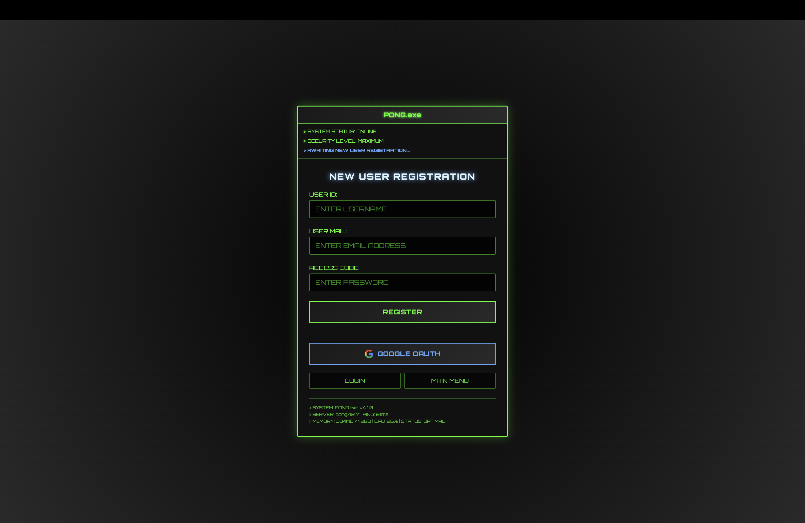

# 🏓 Pong Game

A modern multiplayer Pong game built with TypeScript, featuring real-time gameplay, tournaments, social features, and comprehensive monitoring.

🎮 Play Live -> **[pong.cant.tr](https://pong.cant.tr)**

## Overview

What started as a simple Pong game evolved into a full-featured multiplayer gaming platform. The project demonstrates modern web development practices with TypeScript, real-time communication, containerization, and production-ready monitoring.


*The landing page welcomes users with a nostalgic CRT shader effect that sets the retro gaming mood. Pro tip: Try pressing the arrow keys for a little surprise! 🕹️*

## User Journey

### Registration & Authentication

The application starts with a secure user registration system that implements multiple layers of protection.



*Clean registration interface with real-time validation and security features including input sanitization and XSS protection.*

### Main Dashboard

After authentication, users land on the main dashboard which serves as the central hub for all game activities.


*The home dashboard integrates multiple features in a single view: game area for quick matches, friend list management, real-time chat system, and online players list. The component-based architecture allows for seamless updates without page refreshes.*

### Game Experience

#### Pre-Game Lobby

Before each match, players enter a lobby system that handles matchmaking and game setup.


*The game lobby shows opponent information and allows players to prepare for matches. WebSocket connections ensure real-time updates on player status and readiness.*

#### Live Gameplay

The core gaming experience leverages Babylon.js for smooth 3D graphics and WebSocket for real-time synchronization.


*The main attraction - smooth 3D Pong gameplay powered by Babylon.js rendering engine. Real-time multiplayer synchronization ensures fair gameplay with minimal latency. The physics engine handles ball movement, paddle collisions, and scoring.*

### Social Features

#### User Profiles

Each player has a comprehensive profile system that tracks statistics and social connections.


*Detailed user profiles display game statistics, win/loss ratios, match history, and social connections. The friend system allows users to build gaming networks and challenge specific opponents.*

#### Profile Management

Users can customize their profiles and manage security settings through a comprehensive settings panel.


*The profile settings page provides complete account management including avatar upload, two-factor authentication setup, password changes, and privacy controls. All file uploads are validated and sanitized for security.*

## Tournament System

### Tournament Flow

The tournament system manages 4-player competitions with automatic bracket generation and progression tracking.


*Tournament semifinal stage showing the bracket progression. The system automatically manages player advancement and schedules upcoming matches based on results.*


*The climactic tournament final where the remaining two players compete for the championship. The system maintains all tournament history and statistics.*


*Tournament victory screen celebrating the champion with final standings, achievements, and statistical summary. Winners are recorded in the global leaderboards.*

## Monitoring & Operations

### Real-time Monitoring

The application includes comprehensive monitoring using Prometheus for metrics collection and Grafana for visualization.


*Production-ready monitoring dashboard built with Grafana shows real-time system metrics, game statistics, user activity, and performance data. Custom metrics track game-specific events like match completions, user registrations, and system load.*

The monitoring setup includes:
- **System Metrics**: CPU, memory, disk usage via Node Exporter
- **Application Metrics**: Custom game events, user actions, WebSocket connections
- **Performance Tracking**: Response times, database queries, error rates
- **Business Metrics**: Active users, games played, tournament completions

## Technical Architecture

### Frontend Stack
- **TypeScript**: Type-safe development with modern ES6+ features
- **Vanilla TS**: No framework dependencies, custom component system for maximum control
- **Babylon.js**: 3D graphics engine providing smooth gameplay rendering
- **Tailwind CSS**: Utility-first styling for responsive design
- **WebSocket API**: Real-time bidirectional communication
- **Component Architecture**: Custom router and state management

### Backend Infrastructure
- **Node.js + Fastify**: High-performance web server with plugin ecosystem
- **SQLite**: Embedded database for development, easily scalable to PostgreSQL
- **WebSocket Server**: Real-time game state synchronization
- **JWT + Argon2**: Secure authentication with password hashing
- **Speakeasy + QRCode**: Two-factor authentication implementation
- **OAuth2**: Google authentication integration

### Security Implementation
- **XSS Protection**: Input sanitization and output encoding throughout
- **CSRF Protection**: Token-based request validation
- **Rate Limiting**: API endpoint protection against abuse
- **JWT Rotation**: Automatic token refresh for session security
- **Mandatory 2FA**: Enhanced account protection
- **Input Validation**: Server-side validation for all user inputs

### DevOps & Deployment
- **Docker Containerization**: Multi-service architecture with isolated containers
- **Docker Compose**: Service orchestration and networking
- **Nginx**: Reverse proxy, SSL termination, and static file serving
- **Prometheus**: Metrics collection and alerting
- **Grafana**: Dashboard creation and data visualization
- **SSL Certificates**: Automated certificate management

## Project Structure

```
├── frontend/          # TypeScript SPA
│   ├── core/         # Router, WebSocket, Components
│   ├── pages/        # Application views
│   └── services/     # API communication
├── backend/          # Node.js API server
│   ├── modules/      # Feature-based modules
│   ├── middleware/   # Authentication & security
│   └── websocket/    # Real-time communication
├── monitoring/       # Prometheus + Grafana config
├── nginx/           # Reverse proxy configuration
└── docker-compose.yml # Container orchestration
```

## Getting Started

```bash
git clone https://github.com/cantasar/pong-game
make
```

## Technical Challenges Solved

### Real-time Synchronization
Implemented custom WebSocket protocols to handle game state synchronization between multiple clients with conflict resolution and latency compensation.

### Security Architecture
Built multi-layered security including XSS prevention, CSRF protection, input validation, and comprehensive authentication flows.

### Container Orchestration
Configured Docker networking for service communication while maintaining security isolation and scalability.

### 3D Game Physics
Integrated Babylon.js physics engine for realistic ball movement, collision detection, and smooth 60fps gameplay.

### Tournament Management
Developed automated bracket generation, match scheduling, and progression tracking for competitive play.

The application demonstrates enterprise-grade development practices while maintaining clean, maintainable code architecture suitable for production deployment.